# Visual Comparison: MDropDX12 v2.5 vs Milkwave Visualizer

Side-by-side visual comparison of preset rendering between MDropDX12 (DirectX 12) and Milkwave Visualizer (DirectX 9Ex). All captures taken simultaneously with identical audio input via MCP automation.

| Project | Graphics API | Version |
| ------- | ------------ | ------- |
| **MDropDX12** | DirectX 12 | v2.5 |
| **Milkwave Visualizer** | DirectX 9Ex | v3.5 |

---

## Presets Compared

Each preset loaded on both visualizers simultaneously with identical audio. These are the 10 presets from [issue #27](https://github.com/shanevbg/MDropDX12/issues/27), originally reported by IkeC as having rendering differences.

### 1. balkhan + IkeC - Tunnel Cylinders

| MDropDX12 | Milkwave |
| --------- | -------- |
| 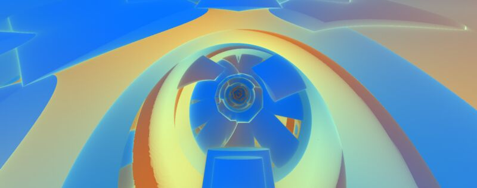 | 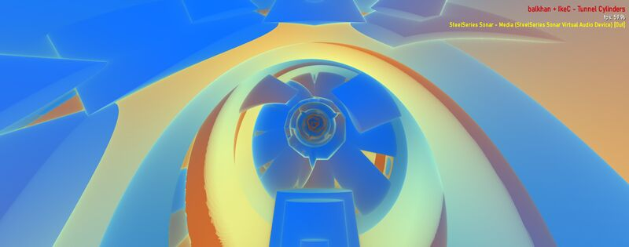 |

Comp shader preset with 3D raymarched tunnel geometry. Both renderers produce the same concentric cylindrical tunnel structure with identical blue/orange/peach color gradients, geometric faceting, and spiral depth recession. IkeC originally reported a solid green screen — fixed by NaN-safe intrinsics and MinPSVersion raise to ps_3_0.

**Verdict:** Visually equivalent.

### 2. BigWings + IkeC - Heartfelt I

| MDropDX12 | Milkwave |
| --------- | -------- |
|  | 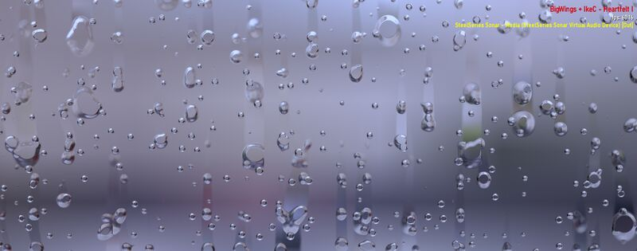 |

Shadertoy rain-on-glass shader (BigWings) ported to MilkDrop comp shader format. Renders realistic water droplets on a glass surface with cloudy sky visible behind. The droplet refraction, surface tension, and trailing streaks all render correctly on both. IkeC originally reported washed out / incorrect rendering.

**Verdict:** Visually equivalent.

### 3. Marex + IkeC - Shadow Party Shader Jam 2025

| MDropDX12 | Milkwave |
| --------- | -------- |
| 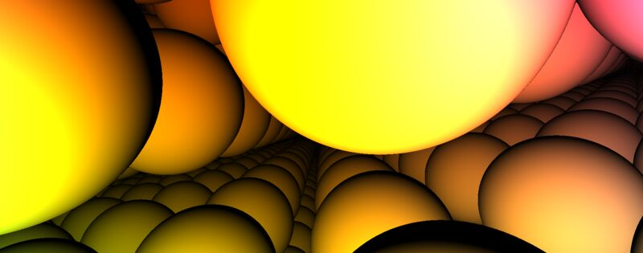 | 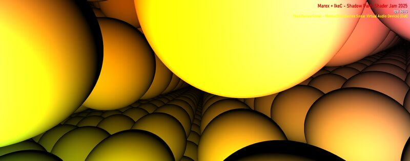 |

Both render the raymarched scene of reflective spheres in a recursive lattice with specular highlights and ambient occlusion. The sphere geometry, color gradients, and lattice structure match. IkeC originally reported completely black — fixed by `FixShadowedUserFunctions` (HLSL X3005 variable/function shadow).

**Verdict:** Visually equivalent.

### 4. BrainStain - re entry

| MDropDX12 | Milkwave |
| --------- | -------- |
| 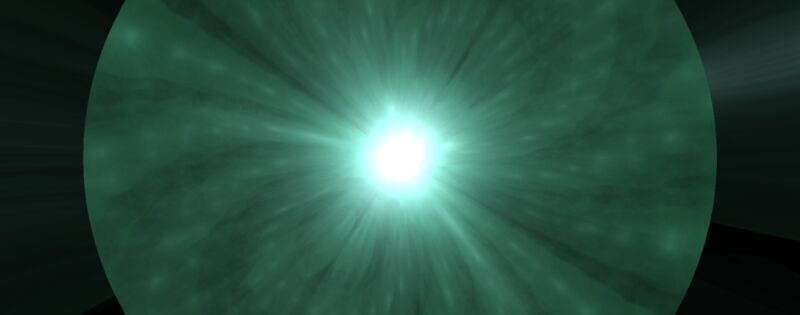 | 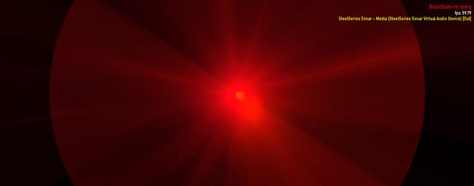 |

Both show the correct starburst structure with radial light rays and audio reactivity. Color differs due to time-based wave color modulation cycling independently. MDropDX12 runs brighter at low volumes due to differences in how energy accumulates through the feedback loop when custom warp shaders skip decay (`fDecay=0.5`). IkeC originally reported bright green starburst (wrong color).

**Verdict:** Close match — structure and reactivity correct, brightness differs at low volumes.

### 5. Flexi - oldschool tree

| MDropDX12 | Milkwave |
| --------- | -------- |
| 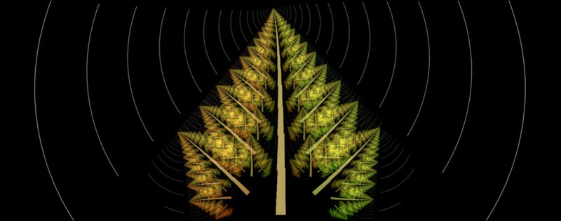 | 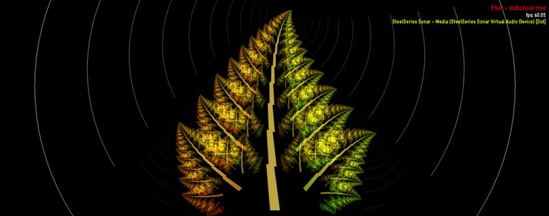 |

Both render the fractal tree with autumn-colored leaves (orange-brown to yellow-green gradient) against a black background with concentric ring ripples emanating from center. The leaf geometry, branching structure, trunk, and internal tile patterns are identical. IkeC originally reported white/overexposed background — fixed by blur UV offset removal and EEL rand() fix.

**Verdict:** Visually equivalent.

### 6. Illusion & Rovastar - Clouded Bottle

| MDropDX12 | Milkwave |
| --------- | -------- |
| 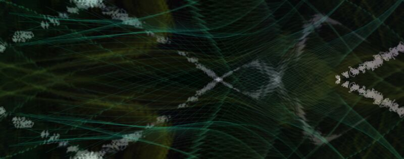 | 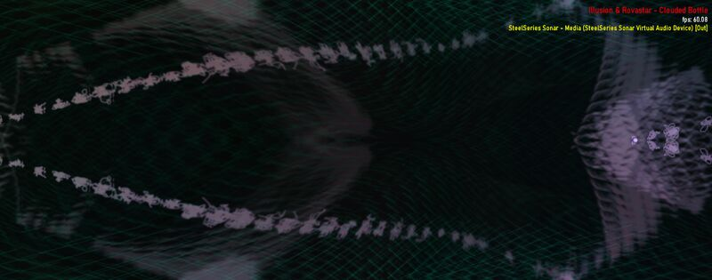 |

Both render the same dark scene with green waveform threads crossing in an X-pattern. The wave line density, color (dark green), and crossing geometry are consistent. IkeC originally reported pink tint (wrong colors) — fixed by sampler addressing for prefixed textures.

**Verdict:** Visually equivalent.

### 7. martin - deep blue

| MDropDX12 | Milkwave |
| --------- | -------- |
|  | 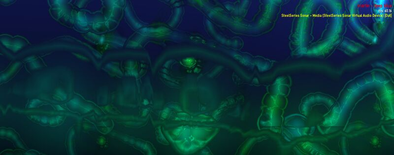 |

Both render deep-sea organic tentacle/tube structures against a dark navy background with matching cyan-green edge glow and internal blue shading. The tube shapes, branching patterns, and color gradients are consistent. IkeC's original report showed a close match.

**Verdict:** Visually equivalent.

### 8. martin - axon3

| MDropDX12 | Milkwave |
| --------- | -------- |
| 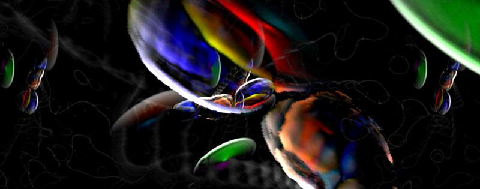 | 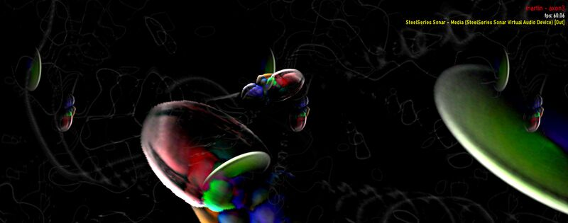 |

Both render dark, iridescent organic neural/axon structures with flowing tentacle shapes, chromatic highlights (red, cyan, yellow, purple), and a deep biological aesthetic. Exact frame content differs due to chaotic per-frame animation, but the visual quality and complexity match. IkeC originally reported white background with fragments — fixed by NaN-safe intrinsics and safe_sqrt sign preservation.

**Verdict:** Visually equivalent.

### 9. shifter - escape the worm (Eo.S. + Phat mix)

| MDropDX12 | Milkwave |
| --------- | -------- |
| 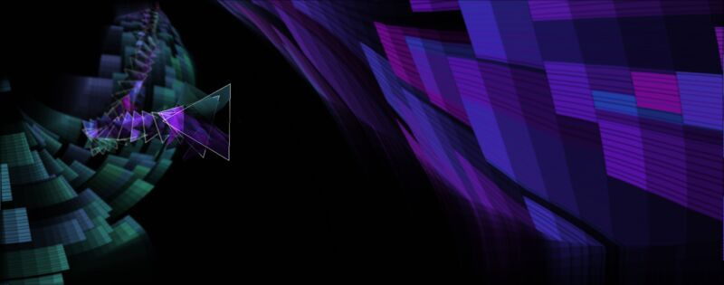 | 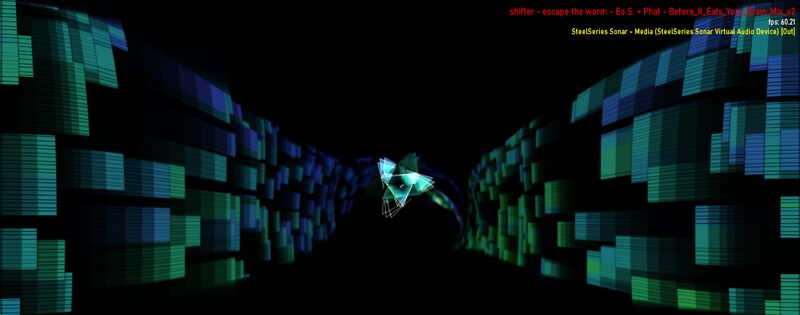 |

Both render the worm-tunnel perspective with colored block walls (blue/purple/teal/green) and a central triangular waveform shape with spiral trail. The block mosaic pattern, color gradients, and tunnel depth are consistent. Camera position differs due to animation timing. IkeC's original report showed a close match.

**Verdict:** Visually equivalent.

### 10. Zylot - Spiral (Hypnotic) Phat Double Spiral Mix

| MDropDX12 | Milkwave |
| --------- | -------- |
| 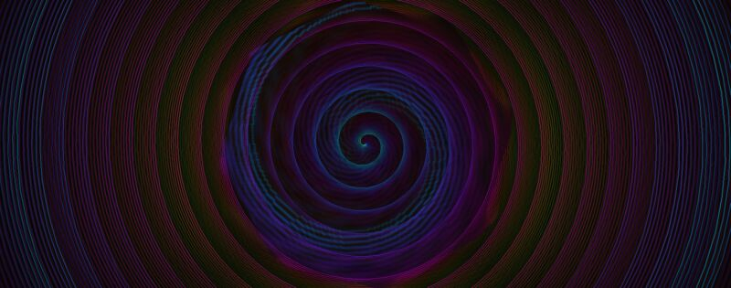 | 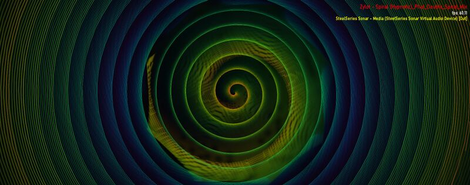 |

Both render the hypnotic double spiral with concentric rings in green, pink/purple, and dark tones. The spiral geometry, color banding, and fine-line texture within the rings match. Color palette differs slightly due to frame timing in the color cycle. IkeC originally reported washed out with wrong colors — fixed by gamma_adj removal for comp shaders and blur UV offset removal.

**Verdict:** Visually equivalent.

---

## Summary

| # | Preset | IkeC's Original Report | v2.5 Status |
|---|--------|------------------------|-------------|
| 1 | balkhan + IkeC - Tunnel Cylinders | Solid green screen | **Fixed** — Equivalent |
| 2 | BigWings + IkeC - Heartfelt I | Washed out | **Fixed** — Equivalent |
| 3 | Marex + IkeC - Shadow Party Shader Jam 2025 | Completely black | **Fixed** — Equivalent |
| 4 | BrainStain - re entry | Bright green starburst | Close match — brightness at low volumes |
| 5 | Flexi - oldschool tree | White/overexposed background | **Fixed** — Equivalent |
| 6 | Illusion & Rovastar - Clouded Bottle | Pink tint (wrong colors) | **Fixed** — Equivalent |
| 7 | martin - deep blue | Close match | Equivalent |
| 8 | martin - axon3 | White background, fragments | **Fixed** — Equivalent |
| 9 | shifter - escape the worm (Eo.S. + Phat mix) | Close match | Equivalent |
| 10 | Zylot - Spiral (Hypnotic) | Washed out, wrong colors | **Fixed** — Equivalent |

**9 of 10 presets** render with matching structure and behavior. BrainStain (#4) has known brightness differences at low audio volumes due to feedback loop sensitivity with aggressive `fDecay=0.5`.

---

## Fixes Applied Since IkeC's Report

- **NaN-safe shader intrinsics** (v2.2): DX12 IEEE 754 strict compliance produces NaN where DX9 NVIDIA returns finite values. Safe wrappers for `sqrt`, `tan`, `pow`, `atan2`, `normalize` prevent NaN propagation through the feedback loop.
- **cDecay vertex color fix** (v2.2): Custom warp shader presets now get white vertices, matching DX9 behavior.
- **Sampler addressing fix** (v2.2): Prefixed noise/random textures (`pw_*`, `fc_*`, `pc_*`) now use correct addressing modes.
- **EEL rand() fix** (v2.1): `rand(N)` returns continuous floats instead of integers under `NSEEL_EEL1_COMPAT_MODE`.
- **Blur UV offset removal** (v2.3): Removed DX9 half-texel UV offsets from blur shaders.
- **gamma_adj removal for comp shaders** (v2.3): MilkDrop3 does not apply gamma for comp shader presets.
- **MinPSVersion raised to ps_3_0** (v2.3): Prevents `ps_2_a` from silently dropping texture bindings.
- **ns-eel2 regNN multiply fix** (v2.3): Fixed optimizer treating all `regNN*regNN` as `sqr(regNN)`.
- **HLSL variable shadowing fix** (`FixShadowedUserFunctions`): Auto-renames local variables that shadow user-defined functions.
- **safe_sqrt sign preservation** (v2.4): Uses `sign(x)*sqrt(abs(x))` to match DX9 behavior.
- **Alpha feedback fix** (v2.4): RGB-only write mask on shape PSOs prevents alpha compounding.
- **NaN-safe atan2** (v2.5): `_safe_atan2(y, x)` prevents NaN at the origin in tunnel/radial presets.
- **Safe normalize** (v2.5): `_safe_normalize()` guards against zero-length vectors in raymarching presets.

### Remaining Known Issues

- **BrainStain - re entry**: Brighter than Milkwave at low audio volumes. Shape/feedback preset with aggressive `fDecay=0.5` where the feedback loop amplifies small per-frame energy differences. Structure and reactivity are correct.

---

## Troubleshooting: Visual Differences from DX9 Implementations

MDropDX12 is a ground-up DirectX 12 rewrite of the MilkDrop2 rendering engine. While it runs the same `.milk` preset files, there are inherent differences in the DX9 → DX12 rendering pipeline that can affect visual output. DX9-based players (BeatDrop, Milkwave, MilkDrop2, MilkDrop3, projectM) may render certain presets differently. See also [issue #30](https://github.com/shanevbg/MDropDX12/issues/30).

### Common causes of visual differences

#### 1. Missing textures (most common — dramatic color/content changes)

Presets can reference external texture files (photos, artwork, noise maps). If a texture is missing, MDropDX12 falls back to a 1x1 white pixel (multiplicative identity) to prevent black screens. This can completely change the color palette and visual content.

**Fix:** Copy texture files from the other player's textures directory into MDropDX12's `resources/textures/` folder. Check the preset's `[TEXTURES]` section to see which files it references.

#### 2. Brightness and color pipeline differences

The DX12 rendering pipeline handles brightness accumulation, decay, and color processing slightly differently than DX9 in certain edge cases:

- **Feedback loop sensitivity**: Presets with aggressive `fDecay` values amplify small per-frame energy differences through the feedback loop
- **IEEE 754 strict math**: DX12 follows IEEE 754 strictly where DX9 NVIDIA hardware deviates (e.g., `sqrt(negative)`, `atan2(0,0)`, `inf*0`). MDropDX12 applies NaN-safe wrappers, but edge cases may still produce subtly different results.
- **Shader model differences**: DX9's `ps_2_0`/`ps_2_a` profiles have lower precision and different optimization behavior than DX12's `ps_3_0`+ minimum.

#### 3. Floating-point precision and texture filtering

Minor differences in texture filtering, interpolation precision, and sampler behavior between DX9 and DX12 can cause subtle variations in blur gradients, warp distortion, and fine detail. These are typically not visible at a glance but compound through the feedback loop over time.

### Quality settings

| Setting | Default | How to change | Effect |
| ------- | ------- | ------------- | ------ |
| **Render Quality** | 1.0 (100%) | Visual window slider | Scales internal render target resolution. Lower = faster but blurrier. |
| **Quality Auto** | Off | Visual window checkbox | Auto-scales quality based on display resolution. Disable for maximum sharpness. |
| **Mesh Size** | 64 | Visual window slider (8–192) | Warp/shape mesh vertex density. Higher = smoother curves and distortion. |
| **Texture Precision** | 8-bit | Visual window combo (8/16/32-bit) | Higher precision reduces color banding and improves feedback loop accuracy. |

### Reporting differences

When reporting visual differences, please include:

1. **Preset name** (exact filename)
2. **Screenshots from both players** with the same preset loaded
3. **Window resolution** of both players
4. Whether the preset uses a **comp shader** (check for `[COMP SHADER]` section in the .milk file)
