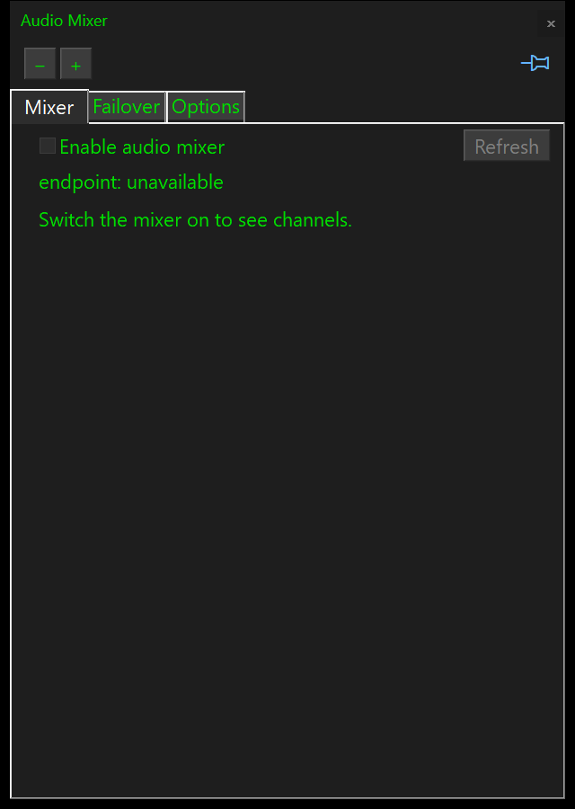
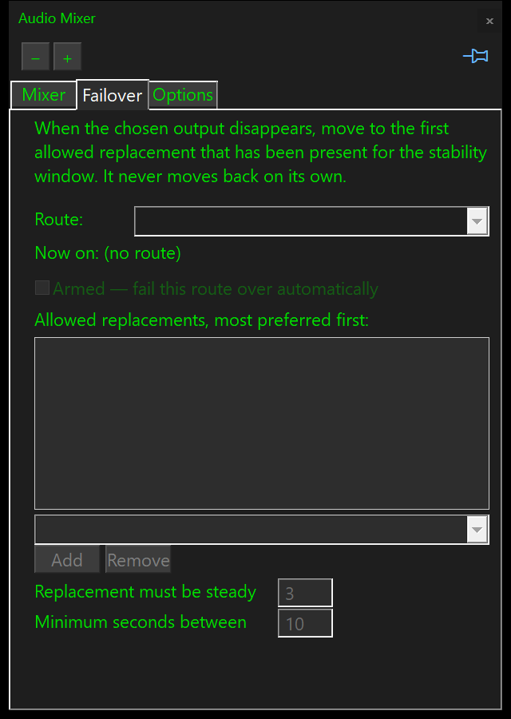
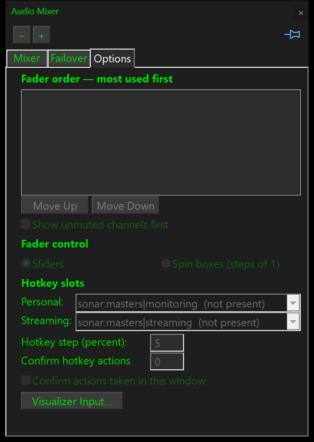
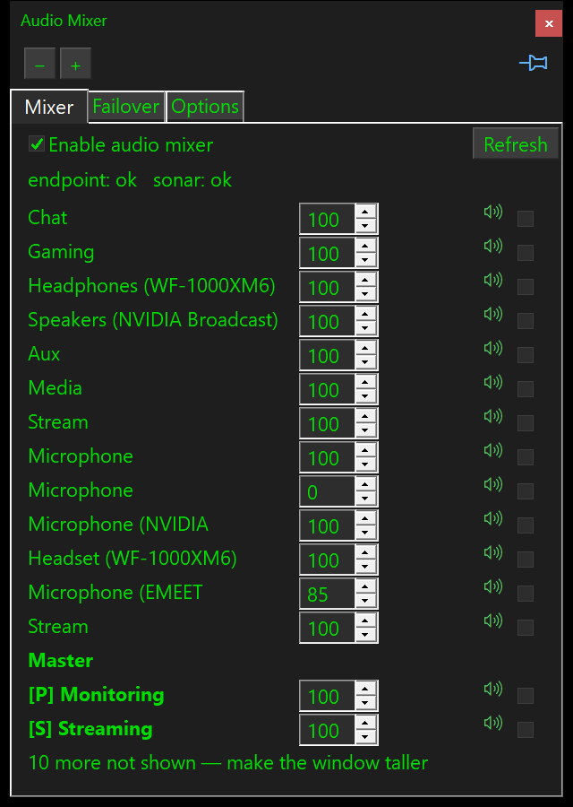

# Audio Mixer

MDropDX12 can control more than one audio volume. A **channel** is one
controllable lane; each channel owns one or more **faders**. A Windows audio
endpoint has a single `main` fader. Other providers may publish more — a
SteelSeries Sonar channel, for example, carries independent `monitoring` and
`streaming` levels — so a client renders as many sliders as the channel has
faders and never needs to know which provider it is talking to.

The subsystem is **off by default**. Turn it on with `MIXER_ENABLE=1`, from the
window, or by setting `"enabled": true` in `resources/mixer.json`.

It starts with the app when enabled, on a thread of its own — see forgejo#46 for
why that is worth a thread. An armed failover route is therefore being watched
from launch, without anyone opening a window.

## The window

Open it with **Open Audio Mixer** — an unbound hotkey, bind it in the Hotkeys
window (Ctrl+F7) — or from Settings > Tools, or as part of a Workspace Layout.
All three lists are built from the same hotkey entry, so there is one place to
find it however you look.

### Mixer

One row per fader. The name on the left is trimmed to the part that identifies
it — a Windows endpoint is called something like
"SteelSeries Sonar - Chat (SteelSeries Sonar Virtual Audio Device)", and six of
those are indistinguishable in any column narrow enough to leave room for a
slider — with the whole name on a tooltip.

- A **speaker** marks the state: green for live, red for muted. The box beside
  it is what you click.
- **[P]** and **[S]** say which of a channel's two faders a row is: **[P]** is
  the personal level, what you hear, and **[S]** the streaming one, what goes
  out. Sonar publishes that pair per channel in streamer mode, so the tags read
  the same way down the whole column — `Aux [P]`, `Aux [S]`, `Chat [P]`, and so
  on. A fader that is neither shows its own name after the channel instead.
- **A multi-fader channel has no heading.** Its name is in the row label, which
  is what makes `Aux [P]` and `Aux [S]` two lines rather than three. Five
  channels means five lines returned to faders, and the list shows as many as
  fit — so those lines are the difference between a fader being reachable and
  being below the fold. `Devices` keeps its heading, because it covers the
  whole single-fader endpoint run rather than one channel.
- **Refresh** re-reads every provider. Nothing polls on a schedule, so a
  channel that appeared while the window was shut needs asking for.
- The list shows as many faders as fit and says how many it did not, because a
  list that quietly stops reads as "that is all this machine has".

### Failover

Per route: which device it is on now, whether it is **armed**, the ordered list
of allowed replacements, and the two timings. Nothing here moves any audio
until a route is armed.

The list of replacements offers every audio device Windows knows about, not
just the connected ones — the useful entries are exactly the ones switched off.
It is grouped: connected first, then the rest, each alphabetical, and the
disconnected ones carry **when they were last seen**.

That last part is what tells identical devices apart. Four pairs of the same
Sony earbuds all pair as `WF-1000XM5-1` through `-4`, and every failed attempt
to rename one leaves another dead entry behind; on this machine fifteen of the
nineteen were months old and four had been used within a day. The time matters
as well as the date — three of the four were last seen on the same day.

Strictly it is the last-write time of the endpoint's registry key, which
Windows rewrites as a device comes and goes. Any property change moves it too,
which is why the label says "seen" and not "connected".

`DEVPKEY_Bluetooth_LastConnectedTime` was tried as an exact replacement and
**rejected**. It exists, it reads, and its pid is 11 on fmtid
`{2BD67D8B-8BEB-48D5-87E0-6CDA3428040A}` — measured with
`bt_lastconnected_probe.cpp`, because PowerShell resolves the property by name
and never shows its GUID, and a second unnamed FILETIME sits at pid 5 holding
the same value. What could not be established is what its value *means*: for
two headsets it sat exactly one timezone offset from the registry time for the
same device, which reads like a UTC/local mix-up, and for a third it was eleven
and a half hours out, which no single offset explains. Two further traps found
on the way, worth knowing before anyone tries again — the lookup only reaches a
disconnected device's node via `CM_LOCATE_DEVNODE_PHANTOM` with the
present-filter dropped, and once phantoms are included a container holds dozens
of nodes from old re-pairings, so anything but "newest wins" picks one at
random and can date a device connected this morning to last October.

A timestamp that cannot be shown to be right is worse than an approximation
that is labelled honestly, so the approximation stands.

Monitors are left out. Windows keeps an HDMI endpoint per port per graphics
card whether anything is plugged into it or not; they were 76 of 84 entries
here, and none of them is somewhere headphones go. The test is
`PKEY_AudioEndpoint_FormFactor`, not the spelling of the device name.

The box is typeable as well as pickable, so a device Windows has forgotten
entirely can still be named. Either way what gets stored is the plain name —
everything after it on screen is decoration.

### Options

- **Fader order.** Most used first. The Mixer tab shows as many as fit, so on a
  machine with two dozen endpoints this list decides which ones are reachable
  without resizing. A device that appears later goes to the bottom rather than
  pushing aside something used every day.
- **Show unmuted channels first.** Off by default. Sorts by CHANNEL, not by
  fader, so a channel with one fader muted and another live stays in one piece
  under its heading.
- **Group ticks.** The tick beside each fader puts it in the hotkey group, so
  one key moves as many faders as are ticked. The list is the same list the
  order buttons drive — one control, because this page has no room for two.
- **Fader control.** Sliders, or spin boxes that step by one percent:

  

- **Confirmations**, for the hotkey and for this window. Both off by default —
  a bound key and a button in your own window are each things you reached
  deliberately. The remote surface is separate, defaults to ON, and cannot be
  relaxed until a PIN is configured.
- **Visualizer Input…** — a link to where the visualiser's own input device is
  chosen, which is a Settings window setting and the one question this window
  raises that it cannot answer. It lands on the combo itself, not merely the
  right tab. It stays live while the mixer is off, because the answer is worth
  having either way.

### The volume hotkeys

Three actions — **Group 1 Volume Up**, **Group 1 Volume Down** and **Group 1
Mute** — move every fader ticked in the Options tab. All three ship unbound;
bind them in the Hotkeys window (Ctrl+F7).

- **Up and down clamp per fader, not per group.** A group whose members sit at
  different levels keeps those differences after the key is held at the top and
  let back down. Scaling the members together, or refusing the whole press
  because one of them has hit the rail, would both flatten the group to one
  level after a few presses.
- **Mute is one decision for the whole group**, not a toggle each: if any
  member is unmuted the key mutes them all, otherwise it unmutes them all.
  Toggling each independently leaves a group whose members disagree
  flip-flopping between two mixed states, and a mute key has to be able to
  reach silence. A fader that refuses mute — both Sonar masters do — is skipped
  rather than being allowed to decide the group's direction.
- **The notification counts, it does not name.** Five fader names do not fit,
  and the count is the part that says whether the key reached what you expected.
  A group with nothing ticked says so, which is a different message from a
  group whose hardware is switched off.

There is **one group** at present. The count is not capped in the code: a
second is an entry in `mixer.json` and three more actions.

> These replaced two named slots, "personal" and "streaming", that each pointed
> at a single fader. Those were never asked for — the commit that added them
> said they existed so that "two keeps the action list at eight however many
> channels a provider publishes" — and they did not do the job. A group with
> one fader ticked is exactly what a slot was, so nothing they could do is lost.

### What it costs while it is open

Nothing, unless you are looking at it. The subscription that makes providers
report follows whether the window is actually in front — not merely whether it
is open — reconciled once a second. A mixer window sitting behind the
visualiser polls nothing.

## Where the settings live

`resources/mixer.json`, not `settings.ini`. Everything the mixer knows is in
that one file: the enable flag, the confirmation policy, the hotkey groups, the
fader order and style, the failover timings and per-route allowlists, and the
device names below.

Two things made an INI the wrong shape rather than merely a less tidy one. The
allowlist and the fader order are **ordered lists**, which an INI writes as
`Order.0`..`Order.63` and `Route.<id>.0.Id`..`15.Name` — dozens of padded keys
to express a list of six, with every read stopping at the first gap. And a
route id contains a colon, `sonar:monitoring`, which is not wanted in an INI
key: it had to be written as `sonar_monitoring`, and nothing in the file
recorded where the colon had been.

There is no migration from the old `[AudioMixer]` section, deliberately — the
settings and the file arrived in the same release.

### Under test: a copy of the real settings, never the real file

Testing mode raises the config write shield, and `Save()` honours it — so by
default a test run reads the real settings and writes nothing to disk, exactly
as `settings.ini` behaves.

That leaves persistence itself untestable, since saving is a no-op through a
shield. `MIXER_CFG_FILE=<path>` is the way through: it redirects the store to a
file the test owns, where writes are real. **A new scratch file is seeded with
a copy of the current settings**, so the redirect changes where writes go and
nothing else. An existing one is read as it stands, so a fixture can be laid
out in advance and a re-run continues from it. `MIXER_CFG_FILE=` with no path
returns to `resources/mixer.json`; `MIXER_CFG_PATH` reports which is in use.

The seeding is not incidental. This briefly worked the other way — a redirect
reset the store to defaults, because two tests asserting an empty route were
finding real devices in it. That was backwards. An empty store makes every
suite test an empty machine, where presence, ordering and battery have nothing
to look at and quietly skip, and it is precisely the crowded real case — four
near-identical Sony sets, some connected and some not — that has actually
broken things. A test that wants an empty allowlist clears it and puts it back.

### Our own names for devices

Windows names four identical pairs of earbuds `WF-1000XM5-1` through `-4`, and
will not keep a name you give them: registry edits, rescans and reboots have
all been tried here, and an `IPolicyConfig` property write is refused outright.
So the mixer keeps its own name, in `deviceNames`, alongside the Windows name
it saw at the time.

That second field is the point. A re-paired Bluetooth device comes back under a
brand new endpoint id, and the recorded Windows name is the only thread back to
the same physical earbuds; when the name matches and the id does not, the id is
rewritten and the next lookup is exact. The substitution happens as each
endpoint is read, so the channel list, the route names, the device records and
the failover's own name matching all see one name and cannot drift apart.

`MIXER_RENAME_DEVICE=<id>|<name>` sets one; `<name>` of `-` clears it.

### Last seen: the Bluetooth stack, not the registry

For a **Bluetooth** device this is `DEVPKEY_Bluetooth_LastConnectedTime`, read
from the device's own node and joined to the audio endpoint by ContainerId.
Per-device, months deep, and it survives a reboot.

For everything else it is the last-write time of the endpoint's registry key,
which is an approximation and a poor one: Windows rewrites every endpoint key
whenever the audio stack re-enumerates, so after a reboot each device reads as
"seen at boot" -- one boot here stamped 33 endpoints with the same second
(forgejo#70). It is kept only because it beats a blank, and Windows regards
non-Bluetooth devices as permanently connected anyway, so the question barely
applies to them.

Two things had to be measured rather than assumed, and both are recorded in the
code because getting either wrong is silent:

- **The Bluetooth value is stored in LOCAL time.** It was tried once before and
  rejected for "sitting exactly one timezone offset away" from the registry
  time -- which was `FileTimeToLocalFileTime` converting an already-local value
  a second time. The other half of that rejection, a device "eleven and a half
  hours out", was the *reference* being a bulk re-enumeration months from
  anything that device did. `bt_seen_reconcile_probe.cpp` settles it by
  printing both readings and refusing to arbitrate on a device whose only
  registry stamp is the boot.
- **The container join needs a second route.** `CM_Locate_DevNodeW` resolves an
  `SWD\MMDEVAPI` node only while the endpoint is ACTIVE, which is the opposite
  of when this is needed. Windows also stores `ContainerId` on the endpoint's
  own registry key, and that survives the device being switched off.
  `ContainerForEndpoint` is deliberately left alone, because it gates
  `isVirtual` and `isHandsFree`, which both mean "the node resolved while
  active".

### Battery, and the three nodes it took to find it

A connected Bluetooth headset shows its charge beside it — `[+] XM5 Black #2
100%`. Windows knows the figure, but keeps it nowhere near anything to do with
audio. It is a PnP device property, and it lives on a **third** device node:

    SWD\MMDEVAPI\{0.0.0.00000000}.{guid}          the audio endpoint
    BTHENUM\DEV_<mac>\...                         the Bluetooth device
    BTHENUM\{0000111E-...}\...&<mac>_C00000000    "<name> Hands-Free AG"  <-- here

Only the last carries `DEVPKEY_Bluetooth_Battery`
(`{104EA319-6EE2-4701-BD47-8DDBF425BBE5}` PID 2), its device class is `System`
rather than `Bluetooth` or `AudioEndpoint`, and nothing is persisted: sweeping
the registry under `Enum`, `DeviceContainers` and `BTHPORT` finds no trace of
it, so it has to be read live through the configuration manager.

The endpoint and the AG node are joined by **ContainerId**, which Windows
assigns per physical device and both of them carry — so no MAC address is
parsed out of an instance path.

Three things about it are load-bearing:

- **It is `DEVPROP_TYPE_BYTE`, not `UINT32`.** A read that asks for the wrong
  width still returns `CR_SUCCESS`, so the mistake is a silent wrong answer
  rather than a failure. The probe that established all of this reported "0 of
  14 endpoints have a battery" on a machine where seven were plainly reporting.
- **Only a connected device gets a figure.** Windows keeps the last value it
  was told after a device disconnects — a set of earbuds here has read 1% for
  months, sitting in its case. A number beside a device you are choosing to
  switch *to* would be a reading from the past presented as the present, so an
  inactive endpoint is always `-1`.
- **Plenty of devices report nothing**, only those exposing the hands-free
  profile do. That is ordinary rather than an error, and the row simply has no
  suffix.

Cost is about a millisecond, because the sweep is filtered to the `BTHENUM`
enumerator instead of walking every present device. That is what lets it run on
the window's existing one-second tick while the Failover tab is in front —
`MIXER_BATTERY` re-reads batteries alone, where `MIXER_REFRESH` would also go
out to Sonar over HTTP. It is the only field in the snapshot that changes with
no device event to announce it, which is why it is the only one polled at all.

**One figure per device, not three.** Windows exposes a single byte, so there
is no per-earbud or charging-case breakdown behind it. Sony's earbuds do report
all three, but only over the vendor's own protocol or a Google Fast Pair BLE
advertisement whose payload is account-key encrypted — neither is a small
addition and both break when a vendor changes something. The single figure
still answers the question it is there for: a bud that has been knocked out of
its case is not charging, so it drifts down while its twin stays at 100.

Over IPC, `MIXER_ALLOW=<route>` carries `battery=<n|-1>` per entry, and every
`MIXER_DEVICE` record carries `battery=`.

### The same figure on the HUD

`batt: 68%` sits under the FPS line, on its own toggle -- the `ShowBattery`
action, unbound by default, a check box on Settings -> General, and
`bShowBattery` in `[Settings]`. It is drawn green above 50, amber down to 25
and red at 25 or below, and when there is no figure there is no line: the same
rule the window follows, where an absent battery is a blank cell and never a
zero.

**Which device it is** is the only interesting decision here, and the obvious
answer is wrong. The Windows default render endpoint is Sonar on this machine,
a virtual endpoint with no container and therefore no battery at all -- it
would read blank almost always. The physical headset is where the ROUTES point,
which the Failover tab already shows as *"monitoring -> Headphones
(WF-1000XM5-3), Now on: XM5 Black #2, 100%"*. So the pick order is:

1. the current device of a failover route, armed routes before unarmed ones;
2. the Windows default render endpoint, only as a fallback for a machine with
   no middleware and no routes configured.

`DIAG_BATTERY` reports which of the two answered, so "why is it showing that
number" has an answer that is not a guess:

    DIAG_BATTERY|shown=1|enabled=1|percent=100|source=route|device={0.0.0…}|name=XM5 Black #2

**Two cadences, and neither of them is a new poll.** The candidate list is
rebuilt on the mixer's existing change callback, which is the only moment a
route can move. The charge itself is re-read on the worker's heartbeat, no
oftener than every thirty seconds and only while the line is switched on -- and
`MIXER_BATTERY` recomputes it too, so while the mixer window is open the HUD
simply rides its one-second tick and the slow poll never fires. That is why the
window asks for a battery while the HUD line is on even when the tab in front
shows no battery cell of its own.

The render thread reads a cached integer and nothing else. Walking the endpoint
list once a frame would be wasteful at 60fps and wrong at any rate: it means
reading Bluetooth device nodes, which is not something to do from the frame
loop.

## What ships today

The **endpoint provider**: one channel per active Windows render and capture
endpoint, driven through `IAudioEndpointVolume`. It needs no third-party
software and polls nothing — Windows reports volume and mute changes as events.

It also publishes one **route**, `endpoint:default-render`, which names the
current default output device and can be pointed at another one.

## A limit worth knowing before you rely on it

**A virtual endpoint owned by other software may ignore a volume write.**
Measured here: `SteelSeries Sonar - Aux` accepts `SetMasterVolumeLevelScalar`,
returns success, and then holds its level at 1.0, because Sonar owns that
channel and the Windows endpoint volume is not where its level lives. Nothing
reports an error, because as far as Windows is concerned nothing went wrong.

This is not a defect in the endpoint provider, and it is the reason the mixer is
built around swappable providers rather than around Windows endpoints. Reaching
a Sonar channel means talking to Sonar, which the Sonar provider now does:
`sonar:aux` streaming was set to 0.350, read back after a forced provider
refresh, and restored, so a write really does reach Sonar rather than only the
snapshot. The endpoint provider still moves real devices and still has no
effect on virtual ones.

## What a write costs Sonar

SteelSeries GG hangs regularly on this machine, so the number of HTTP requests
is a correctness property rather than a micro-optimisation — every avoidable
request is another chance to wedge the service the mixer depends on.

**One volume write is one round trip.** It used to be four:

| | then | now |
|---|---|---|
| `PUT …/Volume/x` | 1 | 1 |
| forced read-back inside `SetVolume` | 1 | — |
| `GET /audioDevices` + `GET /streamRedirections`, forced after every batch | 2 | — |
| **total, one write** | **4** | **1** |
| **total, a two-fader group hotkey** | **6** | **3** |

Three rules produce that, and each is easy to undo by accident because each
mistake looks locally reasonable:

- **A write never reads itself back.** The caller's snapshot already carries
  the requested value optimistically, and the worker re-reads the levels once
  after the batch. Reading back inside the write also *races* Sonar — it
  returns values the service has not applied yet, so a fader that was just
  moved springs back to its old level.
- **Refresh once per batch, never per command.** A group hotkey moving five
  faders is five PUTs and one refresh.
- **Routes refresh only on a device event.** A volume write cannot move a
  redirection. A provider must not call `host.Changed()` from its own write
  path either: that means "something moved that nobody asked for", and it is
  the signal that triggers the route re-read.

The worker batches at **5 Hz**. That bounds a dragged slider, where only the
newest value per fader matters and the queue has already collapsed the rest; a
hotkey press or a single IPC write is one command, drained on the next pass and
answered immediately, so the interval never delays a deliberate change.

`SonarProvider::RequestCountForTest()` exists so these counts can be asserted.
The native `mixer_core_test` and `mixer_sonar_provider_test` both pin them, so a
regression fails a test rather than quietly restoring the traffic.

## Confirmed Sonar write verbs

Established 2026-08-30 against a live SteelSeries GG, read-write-restore, and
re-checkable with `private/tools/milk2-probe/sonar_probe.py`.

| Purpose | Verb |
|---|---|
| Channel volume | `PUT /volumeSettings/{mode}/{slider}/{channel}/Volume/{0..1}` |
| Channel mute | `PUT /volumeSettings/{mode}/{slider}/{channel}/isMuted/{true\|false}` |

`{mode}` is `streamer` or `classic`, `{slider}` is `monitoring` or `streaming`,
`{channel}` is one of `masters`, `game`, `chatRender`, `chatCapture`, `media`,
`aux`.

Two things here are easy to get wrong, and both were expensive to find:

- **The slider comes BEFORE the channel.** Channel-first — the obvious reading
  of the GET shape, and what every community example does — returns 400
  "Request validation error". So does a nonsense channel, so the error
  distinguishes nothing.
- **The property names disagree in style.** `Volume` is capitalised, `isMuted`
  is camelCase, and `Mute` returns 404.

The diagnostic tell, should these ever break: **a wrong path shape returns 404;
a right shape with something else wrong returns 400.** `Level` returning 404
where `Volume` returned 400 is what proved the shape rather than the value was
at fault, and `classic/{channel}/Volume/{v}` returning 500 — passing validation,
failing in the handler — showed the four-segment form was structurally valid
while the five-segment one was not. `Allow:` on a 405 confirms the verb.

**Route writes are still unconfirmed.** Pointing a redirection at another device
moves the user's audio, so `/streamRedirections/{id}/deviceId/{id}` is inferred
and must be exercised under supervision, never by a test.

## The protocol

State is flat text, one record per line, so the same record serves both the full
snapshot and a single-fader update:

    MIXER_FADER|ch=endpoint:{0.0.0…}|chname=XM6|provider=endpoint|id=main|label=Volume|vol=0.350|mute=0|health=ok|virtual=0|canMute=1|chwindowsName=Headphones (WF-1000XM6)|battery=68
    MIXER_ROUTE|id=endpoint:default-render|name=Windows default output|device={0.0.0…}|armed=0|state=idle
    MIXER_DEVICE|id={0.0.0…}|name=XM5 Black #2|windowsName=Headphones (WF-1000XM5-3)|flow=render|active=1|display=0|seen=2026-08-31 03:42|battery=100

Channel and route ids contain `:` but never `|`, which is what makes
`MIXER_SET=<ch>|<fader>|<value>` unambiguous.

A fader carries **both names and the battery**, so a client drawing a list has
everything the row needs without joining back to `MIXER_DEVICE` — a join that
means matching an endpoint id it would otherwise never look at:

- `chname` is the SHORT name once one has been given, else what Windows calls
  the channel.
- `chwindowsName` is present **only** when a short name has been given, and then
  carries the Windows name. Its absence is itself the answer to "has this been
  renamed", which is what decides whether a name may be trimmed for display: the
  PC's Mixer tab shows a user-chosen name verbatim and only shortens Windows'
  own naming, because "XM5 - White" trimmed to "White" throws away half of a
  deliberate choice.
- `battery` is `0..100` or `-1`, read live from the device watcher rather than
  from the cached channel — `MIXER_BATTERY` re-reads batteries without
  re-polling any provider, so a figure cached on the channel would not move when
  that verb ran. `MIXER_BATTERY` now also pushes the fader records to
  subscribers, because nothing else would: this is the one field that changes
  with no device event to announce it.

`MIXER_RENAME_DEVICE` waits for the worker before replying, so the reply means
the new name is already in the snapshot. Without that it returned while the
channel list still held the old name, and the window — which rebuilds itself the
instant the reply arrives — drew the name that had just been changed. A refresh
did not help either, because `MIXER_REFRESH` re-polled the providers without
re-reading the **watcher**, and the watcher is where the short name is applied.

`MIXER_STATE` answers in **chunks**, bracketed by `MIXER_BEGIN` and `MIXER_END`,
with whole records packed into messages of at most 3000 characters. Both ends of
that were measured rather than guessed: one combined reply overruns the
8192-byte read a client does and the caller silently keeps only the tail, which
parses cleanly while missing most of the state; and one message per record loses
records, because two dozen back-to-back replies through a request/response pipe
do not all arrive. **A client must read until it sees `MIXER_END`.** The probe
harness does this with `mdrop.MDrop.collect()`.

A `MIXER_SET` reply is optimistic: it carries the value you asked for, not a
value read back from the device. Waiting for the write would block the message
pump behind a provider that may be slow or hung, which is exactly what the
mixer's worker thread exists to prevent. The broadcast that follows carries the
truth, and `MIXER_STATE` always reports what the device actually holds — which
is how the Sonar behaviour above becomes visible.

## Failover

A **route** is a named output path — `endpoint:default-render`, or a Sonar
redirection such as `sonar:monitoring`. Failover re-homes one when the device it
is on disappears.

It is **off**. Nothing is armed by default, and arming is per route.

The rules, in the order they bite:

- **Fail over, never back.** After a switch, the new device *is* the current
  device. Reconnecting the old one does nothing at all; the watcher only wakes
  again when the device you are now on goes away.
- **Cancel on return.** If the original device comes back during the stability
  window, nothing moves. That is the point rather than a side effect: a brief
  Bluetooth dropout costs nothing, and switching too fast is what upsets the
  Microsoft Bluetooth stack in the first place.
- **Opt-in is absolute.** With no allowlisted device present the watcher sits in
  `searching` indefinitely and reports a readable reason. It will never select a
  device you did not list, and a newly-appeared device never joins the list.
- **A minimum dwell** after each switch (default 10 s) stops one bad unplug
  cascading down the priority list.
- **Anyone moving the route re-baselines it**, including you — a manual move
  abandons any pending switch.

Defaults: `StabilitySeconds=3`, `MinDwellSeconds=10`, nothing armed.

### Why an allowlist entry stores a name as well as an id

A re-paired Bluetooth headset can come back under a **different endpoint id with
the same friendly name**. That is not hypothetical here: this machine's Sonar
monitoring route pointed at a `WF-1000XM5-3` while Windows reported the live
device as `WF-1000XM5-4`, and it changed again mid-session. An allowlist keyed
on id alone would silently stop matching the headphones.

So each entry records both, matching by id first and falling back to an exact
name match. The fallback can only ever resolve to an entry you added, so it
never enrols a device on its own.

### Moving the default device flattens three roles into one

Windows keeps **three** default render devices, not one: Console, Multimedia
and Communications. Applications choose between them — a media player follows
Multimedia, a voice app follows Communications — and SteelSeries Sonar uses
exactly this to route apps to different channels.

`endpoint:default-render` writes **all three**, because a switch that moved only
one would leave some apps behind and look half-broken. The cost is that any
distinct per-role arrangement is flattened, and it cannot be restored from
here: the previous assignment is not recorded anywhere before being
overwritten.

Two consequences worth keeping in mind:

- **There is no such thing as a no-op route write.** Setting the route to the
  device that is already default still overwrites the other two roles. Reading
  `DefaultRenderId()` back reports Console only, so such a write looks
  successful and harmless while having moved applications between channels.
- **Restoring means restoring all three.** Anything that moves the route for a
  test must capture Console, Multimedia and Communications first and put all
  three back.

## The heartbeat

Arming and committing are deliberately separate ticks, so the watcher **must**
be ticked periodically rather than only on device events — otherwise a route
that armed and then saw no further event would wait forever. The mixer worker
wakes at least every 100 ms and ticks it there. This was found by the tests, not
by reasoning.

### Endpoints another program owns

Eight Windows endpoints on this machine are SteelSeries Sonar's own, and they
are decoys: `SteelSeries Sonar - Aux` truncates in the column to exactly `Aux`,
sits at 1.000, accepts `SetMasterVolumeLevelScalar`, returns success, and holds
its level — because Sonar owns that channel and the endpoint volume is not
where its level lives. Meanwhile the real `sonar:aux|monitoring` sits at 0.030
below the fold. Every signal on screen pointed away from the actual control
(forgejo#51).

`EndpointInfo::isVirtual` marks them, from the **container** rather than the
name: Windows puts a device belonging to no physical container into the null
container, which is where all six Sonar endpoints, NVIDIA Broadcast and the GS
Wavetable Synth live, while real hardware has a real container. The same read
already decides `isHandsFree`, and a name test would fail on exactly these
because this app carries its own names for devices.

It travels to every surface on the fader record:

    MIXER_FADER|ch=…|chname=…|provider=endpoint|id=main|…|virtual=1

Note what it does *not* mean. NVIDIA Broadcast is caught by the same test and
its endpoint volume works. So it marks "a provider may own me", not "I am
inert" — which is why the window hides these rows by **default** rather than
removing them, with `showVirtualEndpoints` on the Options tab to show them
again. They stay fully addressable over IPC either way: a view rule, exactly as
forgejo#50 requires of hiding.

### Verbs

    MIXER_ROUTE_ARM=<route>|<0|1>            opt a route in or out
    MIXER_ALLOW_ADD=<route>|<deviceId>       append to the ordered allowlist
    MIXER_ALLOW_REMOVE=<route>|<deviceId>    remove an entry
    MIXER_ROUTE_SET=<route>|<deviceId>       move it now; cancels a pending switch
    MIXER_ALLOW_MOVE=<route>|<id|name>|<delta>  reorder; the order IS the preference
    MIXER_ALLOW[=<route>]                    the allowlist: order, presence, last seen
    MIXER_BATTERY                            re-read battery for connected devices
    DIAG_BATTERY                             the HUD figure: toggle, percent, source, device
    DIAG_BATTERY_SIM=<0-100|off>             force the HUD figure, in memory only
    DIAG_FAILOVER                            armed, state, allowlist and reason
    MIXER_SIM_DEVICE=<id>|<present|gone|current|forget>   testing mode only

`MIXER_ALLOW` answers one row per entry, in priority order, then a terminator:

    MIXER_ALLOW|route=<r>|pos=0|id=<id>|name=<name>|present=1|seen=<when>
    MIXER_ALLOW_END|route=<r>|count=<n>

`present` is whether the device is connected right now; `seen` is when it last
was, and is empty for an entry naming a device this machine has no record of --
one added by name for hardware that has never been plugged in. An absent date
is left absent rather than filled in, the same rule the battery figure follows.

### Reading the list a different way

The order shown is chosen by `View:` above the list, and stored as `allowSort`
in `mixer.json`:

    0  Preferred order   the rule itself, and the default
    1  Device            by name, ignoring the presence marker
    2  Battery           fullest first; "no figure" together at the end
    3  Last Seen         most recent first; devices here NOW come first of all

It is a view and only a view. **A sort is never written back to the rule** --
the watcher takes the first entry that is present, so saving a sorted order
would silently repoint where the audio goes. This window has been bitten by
exactly that once already, in the fader list, where the order was taken after a
sort and a channel climbed the list on its own.

**The Move Up / Move Down arrows appear only in Preferred order.** A move edits
the rule; seen through a column sort it would take the row somewhere off screen
while the visible list sat still, so the button would read as broken. Same trap
as forgejo#65 -- a list drawn in one order and moved in another -- and hiding
the control is the honest answer rather than explaining it afterwards. The
heading changes with the mode too, since "most preferred first" would otherwise
be a plain lie about the rows on screen.

Every column sorts the underlying fact, never the cell text, and each of the
three is a trap for a string sort:

- **Last Seen** is display-formatted (`Today 13:04`, `Ystrdy 15:46`), and
  sorting that puts Today below Ystrdy and both above every real date. It is
  also **empty for a device that is here now** -- the presence marker already
  says so -- and those are the most recent of all, where a string sort files
  them last.
- **Battery** is `"50%"` or empty, so `"100%"` sorts before `"9%"` as text.
  Empty is ordinary rather than missing, so those group at one end.
- **Device** carries a presence-marker prefix, so sorting the cell sorts by
  connected-ness first and name second.

`MIXER_ALLOW` is unaffected and always answers in **rule** order: a client
reordering the list needs the rule, and one that wants to draw it sorted can
sort what it is given, since every field is already on the wire.

`seen` on the wire is always the absolute `YYYY-MM-DD HH:MM`. The window draws
today's and yesterday's as `Today 13:04` and `Ystrdy 15:46` -- a date is the
wrong unit for something seen an hour ago, and the two most recent are the two
anyone is choosing between. That substitution is display-only, in
`seen_format.h`: the device dropdown orders by string comparison on the stored
value (`a.seen > b.seen`), so rewriting it would sort Today below Ystrdy and
both above every real date. A remote can make the same substitution itself, in
its own timezone, which it could not do from a pre-formatted label.

The time is kept either way, never just the day. Three of the four Sony
pairings here were last seen on the same date and are told apart only by the
hour.

This is deliberately not folded into `DIAG_FAILOVER`. That reply's `allow=` is a
bare comma-separated id list which the failover tests parse, and widening it
would break them in order to say something this says better.

**The order is the preference, not decoration.** The watcher takes the first
entry that is present, so moving a row up is exactly "reach for this one first".
`MIXER_ALLOW_MOVE` swaps with the neighbour and clamps at the ends -- pressing
Up on the top row is a no-op rather than an error, because that is what someone
holding the button does. It takes a signed delta, matching `MIXER_ORDER_MOVE`
for faders, so a client driving both needs one pattern. The entry is named by id
OR by name, because the entries most worth reordering are the ones that are not
connected, and those have no id at all.

`MIXER_SIM_DEVICE` lies to the watcher about which devices exist. That is the
only way to test disconnect and re-pair without hardware, and exactly why it is
refused unless testing mode is on.

**Moving a Sonar redirection is unproven.** `SetRouteDevice` for a `sonar:` route
is written but has never been executed, because doing so moves real audio out of
your ears. Exercise it deliberately, never from a test.

## Two lists: the order, and what is drawn

`MIXER_ORDER` is the **stored** arrangement — the one `mixer.json` holds and the
one a move edits. What the Mixer tab draws is that list with three view rules on
top of it, so the two are not the same list and a client rendering `MIXER_ORDER`
shows something the person at the PC is not looking at (forgejo#65):

| rule | what it does |
|---|---|
| `sortUnmutedFirst` | floats channels in use above muted ones, across the stored prefix |
| `pinFailoverDevices` | lifts every connected endpoint on any route's allowlist to the top — applied last, so it beats both |
| `showVirtualEndpoints` | off, so provider-owned endpoints are not drawn at all |
| `showHiddenFaders` | off, so faders the user hid are not drawn — see below |

The rules are computed in the **engine**, not while drawing, so the answer is the
same whether the Mixer window is open or not, and there is one implementation
rather than a second copy in the window that can drift from it. The window
orders its own rows from that same call.

`MIXER_ORDER` deliberately keeps reporting the stored order. `MIXER_ORDER_MOVE`
rebuilds its working list from it and writes the result back through
`MixerSetFaderOrder`, so answering with a sorted view there would save the view
into `mixer.json` — the bug already fixed in the window, where a device climbed
the list on its own every time anything was reordered.

    MIXER_VIEW                               the list as DRAWN
    MIXER_ORDER                              the list as STORED
    MIXER_ORDER_REV                          just the token, for a quick check
    MIXER_ORDER_MOVE=<ch>|<fader>|<delta>[|<rev>]   move one row
    MIXER_ORDER_SET=<rev>|<key>,<key>,…      push a whole arrangement

## Per-fader preferences: hidden, and a short name

Three things now key on the same `<channel>|<faderId>` space, and share their
storage rather than each inventing a scheme (forgejo#50, forgejo#52):

| | verb | stored as |
|---|---|---|
| order | `MIXER_ORDER` / `MIXER_ORDER_MOVE=` | the `order` array |
| hidden | `MIXER_HIDE=` / `MIXER_HIDDEN` | `faderPrefs.<key>.hidden` |
| short name | `MIXER_FADER_NAME=` | `faderPrefs.<key>.short` |

    MIXER_HIDE=<ch>|<fader>|<0|1>       hide or reveal one fader
    MIXER_HIDDEN                        the hidden set, then MIXER_HIDDEN_END
    MIXER_FADER_NAME=<ch>|<fader>|<name>   empty name clears

Both are **server-side**, for the reason the order already is: a preference held
on two surfaces drifts the moment either end changes, and there is no
reconciliation to reach for — the loser is whichever was edited first. Hide a
fader on the phone and it is hidden at the PC, and the other way round.

### Why they are not entries in `order`

One list carrying position and attributes together is the tempting shape and it
is wrong here. Absence from `order` already MEANS something — "unordered, show
after, in provider order" — so listing a fader there just to record its short
name would silently give it a position it never had.

### hidden is a view preference and nothing else

A hidden fader keeps its level and its mute state, keeps its place in `order` so
revealing puts it back where it was rather than at the end, and **still answers
every write verb**. That last one matters: a volume-hotkey group can legitimately
name a fader the user has hidden — hiding the Master rows once the groups are
pinned to the top of a phone screen is an obvious thing to do — and hiding must
not quietly stop that key working.

Setting one for a fader nothing answers to is refused (`MIXER_ERR|reason=
unknown_fader`) rather than stored. The preference itself is keyed by string and
survives a device being switched off; it is *setting* one blind that is a typo
far more often than it is intent.

### Two senses of the word "hidden", kept apart

| record | field | means |
|---|---|---|
| `MIXER_FADER` | `hidden=` | the stored preference, on its own |
| `MIXER_VIEW` | `hidden=` | not drawn, for ANY reason |
| `MIXER_VIEW` | `userHidden=` | not drawn *because* of the preference |

A client needs the distinction because "Show hidden faders" and "Show virtual
endpoints" are separate switches, and offering to reveal a row the *other*
switch is suppressing would do nothing.

### The short name is an alias, not a replacement

`chname` and `label` keep reporting the originals, so a client can still show
"Aux — Monitoring" in a tooltip when a short name is cryptic — someone who names
a fader "P2" six months ago needs a way to find out what it was. On the PC the
label precedence runs: per-fader short name, then a user's device rename, then
the automatic `ShortName()`, then the raw name. The short name wins because it
is the most specific thing anyone has said about that row: a device rename
covers every fader on the device, and a Sonar channel carries two.

### At the PC

Both live on the Options page, in the group that already holds the fader order —
that list is "the settings for the fader you picked", so a second group beside it
would split one idea in two. **Hide fader** / **Show fader** toggles the selected
row, and a **Short name** box with **Set** names it. **Show hidden faders**, over
with the other view switches, is the way back: without it a fader hidden from the
phone could only be recovered by editing `mixer.json`.

`MIXER_VIEW` answers one row per fader, then a terminator:

    MIXER_VIEW|pos=0|order=24|hidden=0|pinned=1|key=endpoint:{0.0.0…}|main
    MIXER_VIEW_END|count=25|shown=17|hidden=8|rev=1a2b3c4d|sortUnmutedFirst=0|pinFailoverDevices=1|showVirtualEndpoints=0

`order` is the row's index in `MIXER_ORDER` space, because a client **renders the
view and moves in the order**: the two are different coordinate systems and this
is the bridge between them. `pos` is the drawn row, or `-1` for a hidden one —
hidden rows are reported rather than omitted so a client can offer the same
switch. `pinned` says a row is at the top because it is a failover target, which
a client cannot work out for itself: that needs every route's full allowlist and
`MIXER_ROUTE` carries only the route's current device. The three flags on the
terminator let a client *explain* the list rather than only mirror it.

Only faders that EXIST are rows. The stored order keeps a place for a device
that is merely switched off (`MergeAbsentFaderOrder`) and the window does not
draw one, so `MIXER_ORDER` is the longer list of the two.

**`key=` is always the last field of any record carrying one.** A key is
`<channel>|<fader>` and so contains the field separator, so a reader takes
everything after `|key=` rather than one field of the split. A field placed
after it is silently swallowed into the key and the client then looks up a fader
that does not exist.

### The arrangement token

`rev` is a short hash of the addressable order, the drawn sequence and the three
view flags. It exists because the PC reorders the list on its own — a failover
device connecting is pinned to the top by the app — so a remote showing a list
it fetched a minute ago may have a different fader under the user's finger than
the one the PC would move.

Supply it and a move is refused if the arrangement changed since:

    -> MIXER_ORDER_MOVE=sonar:aux|monitoring|-1|1a2b3c4d
    <- MIXER_ERR|reason=stale|rev=9f04c7b1

The refusal carries the current token, so a client re-fetches and re-asks
without a second round trip to find out what changed. On `MIXER_ORDER_MOVE` the
token is **optional** — the existing three-argument form still works unguarded.
On `MIXER_ORDER_SET` it is required, because a client sending a complete list is
asserting what the whole order should be, and doing that from a stale view would
silently discard anything changed at the PC in between.

`MIXER_ORDER_SET` takes the keys comma-separated, since a bar appears inside
every key and a comma inside none. Keys must all exist and none may repeat; a
key the client leaves out keeps its relative order and is appended, because a
phone sends the rows it was showing and the ones it never saw must not be
dropped for it.

### Being told, rather than polling

Subscribers are pushed `MIXER_VIEW_CHANGED|rev=<new>` whenever the arrangement
moves — a device arriving or leaving, a reorder made at the PC, a view flag
toggled in the window. Only the token goes out, never the list: a client
compares eight characters against what it holds and asks for `MIXER_VIEW` only
when they differ, so the ordinary case of a fader moving costs one short message
instead of twenty-five rows. It cannot race a client's own fetch either, since
the token it carries is the one the next fetch will answer with.

The window has the same problem and now the same answer. Its one-second tick
rewrites the values of the rows that exist; it cannot notice that there are
*different* rows or the same rows in a different order — so a failover device
connecting was pinned to the top by the engine and the window went on drawing
the old arrangement until Refresh was pressed by hand. It now compares the token
on that tick and relays out when it moved, though never while the mouse is
captured: a rebuild recreates every control and would drop a held slider
mid-drag.

## When anything is read

Nothing polls. A level is read for exactly two reasons: someone asked
(`MIXER_STATE`, or a client that sent `MIXER_SUBSCRIBE=1`), or the mixer
ToolWindow is open **and** active. Enabling the subsystem does not start a
heartbeat, and any polling a provider does is capped at 1 Hz.

Device presence is never polled at all — it comes from a single
`IMMNotificationClient`, so a device appearing or disappearing wakes the mixer
rather than being discovered on a timer.

Broadcasts follow the same rule: with no subscriber, an enabled mixer is silent
on the wire as well as idle.

## Limits

- The subsystem runs only while MDropDX12 runs.
- `MIXER_SUBSCRIBE` is currently counted process-wide rather than per
  connection, so a client that disconnects without sending `MIXER_SUBSCRIBE=0`
  leaves the count raised until the subsystem is disabled. Per-connection
  cleanup arrives with the ToolWindow work.
- `SET_DEVICE_VOLUME` and its siblings are unchanged and still work. They drive
  the same Windows API, so they and the mixer always agree, and the endpoint
  callbacks mean the mixer sees changes those verbs make.

## Restarting SteelSeries

**There is no button for this.** Shipping one that kills another vendor's
software reads as a swipe at them whatever it is for, and it is not one. The
capability is off the shelf rather than on it: an **unbound hotkey** the user
binds themselves, and `MIXER_SONAR_RESTART` over IPC. Both are deliberate acts.

The mixer can stop every SteelSeries process and start GG again. It exists
because GG used to hang often and was awkward to kill by hand — it is six
cooperating processes, and killing the GG parent first simply makes it respawn
the children.

It "should almost never be used", and the reason it is needed less is now
settled rather than suspected: the hangs came from **a bug in Sonar's own
device switching, bouncing while not in streaming mode**. That was the owner's
account, and it matches what the restart was written for.

Which matters beyond the history, because our failover does the same job. It is
deliberately slow to move — a stability window before it switches, a minimum
dwell after it has, and it never switches back on its own — precisely so it
cannot bounce the way the thing it replaces did. Any future change that makes
failover quicker to react is trading against the exact failure that made a
restart button seem necessary in the first place.

The restart always asks before acting, whatever the confirmation settings say.
Over IPC it is a two-step: the first `MIXER_SONAR_RESTART` opens the window and
answers `pending=1`, a second inside it performs the restart.

**The end-to-end restart is untested, and stays that way.** This is a decision,
not an outstanding task: a failed restart costs a reboot, and the bug it existed
for is understood, so there is nothing left that running it would settle. Do not
propose testing it.

What *is* tested is everything up to the act — the plan (the kill order, the GG
parent last, the relaunch path) and the confirmation guard, exercised with a
single call that must ask rather than act.

### The health-triggered restart offer was dropped

An offer that watched channel health and proposed a restart when Sonar looked
wedged — "Plan 3 Task 5" — is **decided against**, not pending. Shane's call on
2026-09-08, on the recommendation in #48.

Three reasons, and the third is the general one: the restart stays a deliberate
act off the shelf; the Sonar bug it existed for is understood, so an automatic
prompt would be offering to fix something already explained; and **anything the
app does on its own contradicts the defaults-off rule** that governs every
automatic behaviour here.

No code for it was ever written, so this costs nothing to abandon. It is
recorded here rather than only on the issue because this is where someone looks
before proposing it again.

## Driving the windows over IPC

Not mixer-specific, but this is where it grew. Every tool window can be opened,
closed, moved and pressed by NAME -- the short name its hotkey entry already
carries, the same one the Hotkeys window and settings.ini use. Nothing needs a
window handle, which a remote could not hold anyway.

    UI_LIST                                every window, and whether it is open
    UI_SHOW=<window>[|tab=N][|ctrl=ID]     open it, at a page, on a control
    UI_CLICK=<window>|ctrl=ID              press something in it
    UI_MOVE=<window>|render                centre it on the visualiser's display
    UI_MOVE=<window>|<x>|<y>               or put it where you say
    UI_CLOSE=<window>                      close it

A control request is answered in **two stages**, and that is the load-bearing
part. A tool window is built on its own thread, so whether it holds a given
control is a question only that thread can answer. The request is ACCEPTED at
once, remembered if the window is still being built, and the window replies
`UI_SHOWN|found=…` or `UI_CLICKED|pressed=…` when it has actually looked. A
disabled control reports `pressed=0` rather than being silently ignored.

The first attempt instead had the IPC thread wait two seconds and decide, and
it reported "unknown control" for a control the Settings window certainly has
-- that window takes longer than two seconds to build.

### Where a tool window opens

In testing mode, on the display the visualiser is on, and its position is not
saved. Otherwise its last saved position wins, clamped to a monitor that is
actually attached. `UI_MOVE=<window>|render` is the way to overrule that; it
reports the position it resolved to.
